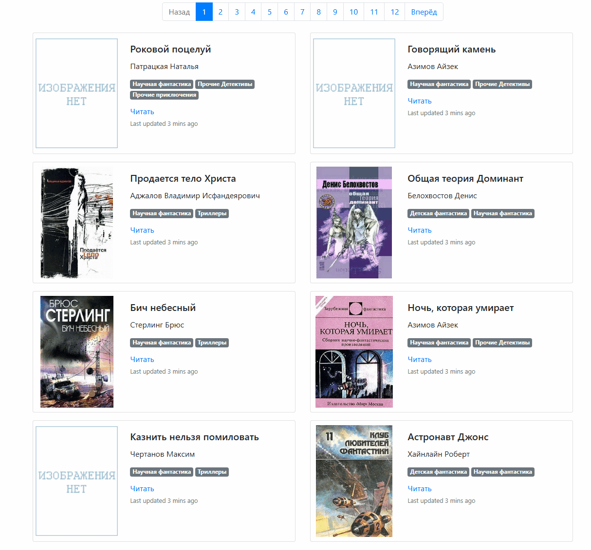

# Онлайн-библиотека

Статический сайт-каталог книг - список с обложками, жанрами, авторами и
постраничной навигацией.\
Сайт генерируется из `meta_data.json` и набора `.txt`- файлов и работает
полностью офлайн.

Ссылка на сайт: https://vasiliykas.github.io/Online-library/




## Оглавление

- [Установка](#установка)
- [Данные](#данные)
- [Как запустить](#как-запустить)
- [Скачать и читать (без установки)](#скачать-и-читать-без-установки)
- [Как это работает](#как-это-работает)


## Установка

- Python 3.12 должен быть установлен
- Скачайте код
- Рекомендуется создать виртуальное окружение. Для этого нужно выполнить команду:
```python
python -m venv .venv
```
- Активируйте виртуальное окружение:
```
.venv\Scripts\activate    # Для Windows
source .venv/bin/activate # Для Linux
```
- Установите зависимости:
```python
pip install -r requirements.txt
```


## Данные

Проект ожидает в корне файл `meta_data.json` и две папки:

- `meta_data.json` — список книг в формате:

  ```json
  [
    {
        "title": "Роковой поцелуй",
        "author": "Патрацкая Наталья",
        "img_src": "img/nopic.gif",
        "book_path": "books/5648-Роковой поцелуй.txt",
        "comments": [],
        "genres": "Научная фантастика, Прочие Детективы, Прочие приключения."
    }
  ]
  ```

- папку `books/` с текстами книг `.txt`
- папку `images/` с обложками (указываются в `img_src`) если обложки нет используйте `nopic.gif`


## Как запустить

- Запустите сервер:
```bash
python render_website.py
```

После запуска в консоли появится адрес — откройте его в браузере

Скрипт:

1. Сгенерирует `docs/index1.html`, `docs/index2.html`, ... — страницы каталога.
2. Сгенерирует `docs/<slug>.html` — страницы чтения для каждой книги.
3. Скопирует `static/`, `img/`, `books/` в `docs/`, чтобы сайт был автономным.
4. Создаст `docs/index.html` — копию первой страницы каталога.
5. Запустит livereload на `http://127.0.0.1:5500/`.

Откройте в браузере:

```
http://127.0.0.1:5500
```

При изменении `base.html`, `book.html` страницы
пересобираются и обновляются автоматически.


## Скачать и читать (без установки)

Если вы просто хотите читать книги, ничего устанавливать не нужно:

1. Скачайте репозиторий: зелёная кнопка **Code** → **Download ZIP**.
2. Распакуйте архив в любую папку.
3. Перейдите в папку `docs` и откройте файл `index.html` двойным кликом — он откроется в браузере.

Готово. Можно читать офлайн, без интернета и без Python.


## Как это работает

`render_website.py` читает `meta_data.json`, раскладывает книги по страницам через `more_itertools.chunked` и рендерит
HTML с помощью Jinja2. Текст книги подставляется в шаблон `book.html`
целиком, переносы строк сохраняются через `white-space: pre-wrap`.

Результат — набор статических HTML-файлов в `pages/`, которые можно
открыть даже без Python.
